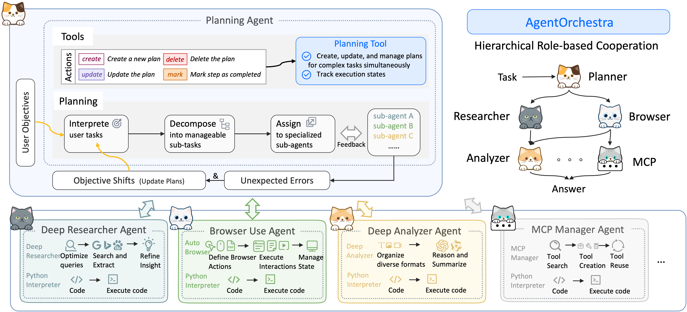

# DeepResearchAgent

[](https://skyworkai.github.io/DeepResearchAgent/)
[](https://arxiv.org/abs/2506.12508)
[](LICENSE)
[](https://www.python.org/)
[](https://docs.python.org/3/library/asyncio.html)

English | [简体中文](README_CN.md) | [🌐 **Website**](https://skyworkai.github.io/DeepResearchAgent/)

## 📋 Table of Contents

- [Introduction](#-introduction)
- [Key Features](#-key-features)
- [Architecture](#-architecture)
- [Installation](#-installation)
- [Configuration](#-configuration)
- [Usage Guide](#-usage-guide)
- [Agent Capabilities](#-agent-capabilities)
- [Tools & Integrations](#-tools--integrations)
- [Advanced Features](#-advanced-features)
- [API Reference](#-api-reference)
- [Performance & Benchmarks](#-performance--benchmarks)
- [Troubleshooting](#-troubleshooting)
- [Development](#-development)
- [Contributing](#-contributing)
- [Citation](#-citation)

## 🎯 Introduction

DeepResearchAgent is a state-of-the-art hierarchical multi-agent system designed for deep research tasks and general-purpose problem solving. Built on an asynchronous architecture, it leverages a sophisticated two-layer agent hierarchy to decompose complex tasks, coordinate specialized agents, and deliver comprehensive solutions across diverse domains.

### Why DeepResearchAgent?

- **Hierarchical Intelligence**: Top-level planning agent coordinates multiple specialized agents for optimal task execution
- **Production-Ready**: Battle-tested on GAIA benchmarks with state-of-the-art performance (83.39% on test set)
- **Multi-Model Support**: Seamlessly integrates OpenAI, Anthropic, Google, and local models
- **Extensible Architecture**: Modular design allows easy addition of new agents and tools
- **Secure Execution**: Sandboxed Python interpreter with configurable security controls
- **Async-First**: Built for performance with native asynchronous operations

> 🌐 **Interactive Demo**: Explore our architecture and capabilities at [https://skyworkai.github.io/DeepResearchAgent/](https://skyworkai.github.io/DeepResearchAgent/)

## ✨ Key Features

### Core Capabilities
- 🤖 **Hierarchical Multi-Agent System**: Intelligent task decomposition and coordination
- 🔍 **Deep Research**: Automated information gathering, analysis, and synthesis
- 🌐 **Web Automation**: Browser control with pixel-level precision
- 🐍 **Secure Code Execution**: Sandboxed Python interpreter with resource limits
- 🎨 **Multimodal Generation**: Image (Imagen) and video (Veo3) creation capabilities
- 🔧 **MCP Integration**: Model Context Protocol for dynamic tool discovery
- ⚡ **Async Operations**: High-performance concurrent task handling
- 📊 **GAIA Benchmark Leader**: Top performance on challenging AI tasks

### Supported Models
- **OpenAI**: GPT-4, GPT-4 Turbo, GPT-3.5
- **Anthropic**: Claude 3.5 Sonnet, Claude 3 Opus
- **Google**: Gemini 2.0 Pro, Gemini 1.5 Pro
- **Local Models**: Qwen 2.5 series (7B/14B/32B) via vLLM

## 🏗️ Architecture

<p align="center">
  
</p>

### System Design

DeepResearchAgent employs a sophisticated two-layer architecture:

#### 1. **Planning Agent** (Top Layer)
The orchestrator that manages the entire workflow:
- **Task Understanding**: Analyzes user requests and identifies requirements
- **Task Decomposition**: Breaks complex problems into manageable sub-tasks
- **Agent Coordination**: Assigns tasks to specialized agents based on capabilities
- **Result Synthesis**: Combines outputs from multiple agents into coherent solutions
- **Dynamic Adaptation**: Adjusts strategy based on intermediate results

#### 2. **Specialized Agents** (Lower Layer)
Expert agents for specific domains:

| Agent | Purpose | Key Capabilities |
|-------|---------|------------------|
| **Deep Researcher** | Information gathering & synthesis | Web search, paper analysis, report generation |
| **Deep Analyzer** | Data analysis & insights | Pattern recognition, statistical analysis, visualization |
| **Browser Use** | Web automation | Pixel-level control, form filling, data extraction |
| **MCP Manager** | Tool orchestration | Dynamic tool discovery, remote/local MCP integration |
| **General Tool Agent** | API & function calling | External service integration, custom tool execution |

### Component Architecture

```
DeepResearchAgent/
├── src/
│   ├── agent/                 # Agent implementations
│   │   ├── planning_agent/    # Top-level orchestrator
│   │   ├── deep_researcher_agent/
│   │   ├── deep_analyzer_agent/
│   │   ├── browser_use_agent/
│   │   └── general_agent/
│   ├── tools/                 # Tool implementations
│   │   ├── python_interpreter.py
│   │   ├── image_generator.py
│   │   ├── video_generator.py
│   │   └── browser/
│   ├── models/                # LLM integrations
│   ├── mcp/                   # MCP protocol support
│   └── registry.py            # Dynamic component registry
├── configs/                   # Configuration system
└── examples/                  # Usage examples
```

## 📦 Installation

### System Requirements

- **Python**: 3.11 or higher
- **OS**: Linux, macOS, or Windows
- **RAM**: 8GB minimum (16GB recommended)
- **GPU**: Optional, for local model inference

### Quick Install

```bash
# Clone the repository
git clone https://github.com/skyworkai/DeepResearchAgent.git
cd DeepResearchAgent

# Create conda environment
conda create -n dra python=3.11
conda activate dra

# Install with Poetry (recommended)
make install

# OR install with pip
make install-requirements
```

### Detailed Installation Steps

#### 1. Environment Setup

```bash
# Option A: Using Poetry (recommended for development)
conda create -n dra python=3.11
conda activate dra
pip install poetry
poetry install

# Option B: Using requirements.txt (for production)
conda create -n dra python=3.11
conda activate dra
pip install -r requirements.txt

# Option C: Using pip directly
conda create -n dra python=3.11
conda activate dra
pip install -e .
```

#### 2. Browser Automation Setup

For web automation capabilities:

```bash
# Install Playwright
pip install playwright
playwright install chromium --with-deps

# For headless operation (optional)
playwright install-deps chromium
```

#### 3. Optional Dependencies

```bash
# For image/video generation
pip install imagen-client veo3-client

# For MCP support
pip install mcp-client

# For advanced web scraping
pip install firecrawl-py

# For local model inference with vLLM
pip install vllm torch
```

## ⚙️ Configuration

### Environment Variables

Create a `.env` file in the project root:

```bash
# Copy template
cp .env.template .env
```

#### Essential Configuration

```env
# Disable warnings and telemetry
PYTHONWARNINGS=ignore
ANONYMIZED_TELEMETRY=false

# Choose at least one LLM provider
# OpenAI
OPENAI_API_BASE=https://api.openai.com/v1
OPENAI_API_KEY=your_openai_api_key

# Anthropic
ANTHROPIC_API_BASE=https://api.anthropic.com
ANTHROPIC_API_KEY=your_anthropic_api_key

# Google Gemini
GOOGLE_API_KEY=your_google_api_key
# OR use application default credentials
GOOGLE_APPLICATION_CREDENTIALS=/path/to/credentials.json

# Azure OpenAI (optional)
AZURE_OPENAI_API_BASE=https://your-resource.openai.azure.com
AZURE_OPENAI_API_VERSION=2024-02-15-preview
AZURE_OPENAI_API_KEY=your_azure_key
```

#### Tool Integration Keys

```env
# Web scraping
FIRECRAWL_API_KEY=your_firecrawl_key

# Model repositories
HUGGINGFACE_API_KEY=your_hf_token

# Local model serving
QWEN_API_BASE=http://localhost:8000/v1
QWEN_API_KEY=dummy_key
```

### Configuration Files

DeepResearchAgent uses Python-based configuration (mmengine format):

#### Main Configuration (`configs/config_main.py`)

```python
from configs.base import base_config

# Model configuration
model_config = dict(
    model_id="gemini-2.0-pro",  # or "gpt-4", "claude-3.5-sonnet"
    temperature=0.7,
    max_tokens=4096
)

# Planning agent configuration
planning_agent_config = dict(
    type="PlanningAgent",
    model_id="gemini-2.0-pro",
    max_steps=30,
    tools=["deep_researcher", "deep_analyzer", "browser_use"],
    template_path="templates/planning_agent.txt"
)

# Tool configurations
tools_config = dict(
    python_interpreter=dict(
        type="PythonInterpreterTool",
        sandbox=True,
        max_execution_time=30,
        allowed_imports=["numpy", "pandas", "matplotlib"]
    ),
    browser_use=dict(
        type="BrowserUseTool",
        headless=False,
        timeout=60000
    )
)

# Merge with base config
config = {**base_config, **model_config, **planning_agent_config}
```

#### Specialized Configurations

- `config_gaia.py`: GAIA benchmark evaluation
- `config_general.py`: Single agent setup
- `config_oai_deep_research.py`: OpenAI-specific research

### Google Gemini Setup

For Google Gemini models:

```bash
# Install Google Cloud SDK
brew install --cask google-cloud-sdk  # macOS
# or
curl https://sdk.cloud.google.com | bash  # Linux

# Initialize and authenticate
gcloud init
gcloud auth application-default login

# Get API key
# Visit: https://aistudio.google.com/app/apikey
```

## 📖 Usage Guide

### Basic Usage

#### 1. Run with Default Configuration

```bash
python main.py
```

#### 2. Interactive Session

```python
# Start interactive session
python main.py --interactive

# Example commands:
> Research the latest developments in quantum computing
> Analyze this CSV file and create visualizations
> Navigate to example.com and extract product data
```

#### 3. Custom Configuration

```bash
# Use specific config
python main.py --config configs/config_research.py

# Override settings
python main.py --model gpt-4 --max-steps 50
```

### Example Use Cases

#### Research Task

```python
from src.agent import create_agent
import asyncio

async def research_example():
    agent = create_agent(config_path="configs/config_main.py")
    
    result = await agent.run(
        "Research recent breakthroughs in renewable energy storage "
        "and create a comprehensive report with citations"
    )
    
    print(result)

asyncio.run(research_example())
```

#### Data Analysis

```python
async def analysis_example():
    agent = create_agent(config_path="configs/config_general.py")
    
    result = await agent.run(
        "Analyze sales_data.csv and identify trends, "
        "create visualizations, and suggest optimization strategies"
    )
    
    return result
```

#### Web Automation

```python
async def browser_automation():
    agent = create_agent(
        config_path="configs/config_main.py",
        tools=["browser_use"]
    )
    
    result = await agent.run(
        "Navigate to news.ycombinator.com, "
        "extract top 10 stories and their discussions"
    )
    
    return result
```

### Running Examples

```bash
# General agent example
python examples/run_general.py

# Deep research example
python examples/run_oai_deep_research.py

# GAIA benchmark evaluation
python examples/run_gaia.py --level 1
```

## 🤖 Agent Capabilities

### Planning Agent

The orchestrator that manages complex workflows:

**Capabilities:**
- Task decomposition and planning
- Multi-agent coordination
- Result synthesis and validation
- Dynamic strategy adjustment

**Configuration:**
```python
planning_agent_config = dict(
    type="PlanningAgent",
    model_id="gemini-2.0-pro",
    max_steps=30,
    enable_reflection=True,
    tools=["deep_researcher", "deep_analyzer", "browser_use"]
)
```

### Deep Researcher Agent

Specialized in information gathering and synthesis:

**Features:**
- Academic paper search and analysis
- Web content extraction and summarization
- Multi-source information synthesis
- Citation management
- Report generation

**Usage:**
```python
result = await agent.run(
    "Use deep_researcher_agent to find and summarize "
    "recent papers on transformer architecture improvements"
)
```

### Deep Analyzer Agent

Expert in data analysis and insights:

**Features:**
- Statistical analysis
- Pattern recognition
- Data visualization
- Predictive modeling
- Anomaly detection

**Usage:**
```python
result = await agent.run(
    "Use deep_analyzer_agent to analyze customer behavior patterns "
    "in the provided dataset and identify segments"
)
```

### Browser Use Agent

Advanced web automation with pixel-level control:

**Features:**
- Visual element detection
- Form interaction
- Screenshot capture
- Multi-tab management
- JavaScript execution

**Configuration:**
```python
browser_config = dict(
    headless=False,
    viewport_size=(1920, 1080),
    timeout=60000,
    enable_screenshots=True
)
```

## 🔧 Tools & Integrations

### Python Interpreter Tool

Secure code execution environment:

**Features:**
- Sandboxed execution
- Import restrictions
- Resource limits
- Timeout control
- Output capture

**Security Configuration:**
```python
python_tool_config = dict(
    type="PythonInterpreterTool",
    sandbox=True,
    max_execution_time=30,
    max_memory_mb=512,
    allowed_imports=["numpy", "pandas", "matplotlib", "seaborn"],
    forbidden_modules=["os", "subprocess", "socket"]
)
```

### Image Generator Tool

Create images using Google's Imagen model:

**Capabilities:**
- Text-to-image generation
- Style control
- Resolution options
- Batch generation

**Usage:**
```python
result = await agent.run(
    "Generate an image of a futuristic sustainable city "
    "with solar panels and green architecture"
)
```

### Video Generator Tool

Create videos using Google's Veo3 model:

**Features:**
- Text-to-video generation
- Image-to-video animation
- Duration control
- Style transfer

**Example:**
```python
result = await agent.run(
    "Create a 10-second video showing the process "
    "of photosynthesis in a plant cell"
)
```

### MCP (Model Context Protocol) Tools

Dynamic tool discovery and integration:

**Features:**
- Local MCP tool loading
- Remote MCP service integration
- Tool registry management
- Authentication support

**Configuration:**
```python
mcp_config = dict(
    local_tools_path="mcp_tools/",
    remote_services=[
        {"url": "https://mcp.example.com", "api_key": "..."}
    ],
    auto_discover=True
)
```

### Web Search & Scraping Tools

**Web Searcher:**
- Multiple search engine support
- Result ranking
- Content extraction

**Archive Searcher:**
- Academic paper search
- ArXiv integration
- Citation extraction

**Firecrawl Integration:**
- Advanced web scraping
- JavaScript rendering
- Rate limiting

## 🚀 Advanced Features

### Asynchronous Operations

DeepResearchAgent is built on asyncio for optimal performance:

```python
import asyncio
from src.agent import create_agent

async def parallel_research():
    agent = create_agent(config_path="configs/config_main.py")
    
    # Run multiple tasks concurrently
    tasks = [
        agent.run("Research topic A"),
        agent.run("Research topic B"),
        agent.run("Research topic C")
    ]
    
    results = await asyncio.gather(*tasks)
    return results

# Execute
results = asyncio.run(parallel_research())
```

### Custom Agent Development

Create your own specialized agent:

```python
from src.agent.base import BaseAgent
from src.registry import AGENT

@AGENT.register("custom_agent")
class CustomAgent(BaseAgent):
    def __init__(self, config):
        super().__init__(config)
        self.custom_param = config.get("custom_param", "default")
    
    async def execute(self, task):
        # Implement your agent logic
        result = await self.process_task(task)
        return result
    
    async def process_task(self, task):
        # Custom processing logic
        pass
```

### Tool Development

Create custom tools:

```python
from src.tools.base import BaseTool
from src.registry import TOOL

@TOOL.register("custom_tool")
class CustomTool(BaseTool):
    def __init__(self, config):
        super().__init__(config)
    
    async def execute(self, **kwargs):
        # Tool implementation
        result = await self.perform_action(**kwargs)
        return result
```

### Local Model Deployment with vLLM

Deploy Qwen models locally:

```bash
# Start vLLM server
CUDA_VISIBLE_DEVICES=0,1 python -m vllm.entrypoints.openai.api_server \
  --model Qwen/Qwen2.5-32B-Instruct \
  --served-model-name qwen2.5-32b \
  --host 0.0.0.0 \
  --port 8000 \
  --max-num-seqs 16 \
  --tensor-parallel-size 2 \
  --enable-auto-tool-choice \
  --tool-call-parser hermes
```

Configure in `.env`:
```env
QWEN_API_BASE=http://localhost:8000/v1
QWEN_API_KEY=dummy
```

### Memory Management

Configure memory systems:

```python
memory_config = dict(
    type="HierarchicalMemory",
    short_term_capacity=100,
    long_term_storage="sqlite:///memory.db",
    embedding_model="text-embedding-3-small",
    similarity_threshold=0.8
)
```

## 📊 API Reference

### Core Classes

#### Agent Base Class

```python
class BaseAgent:
    async def run(self, task: str) -> Dict[str, Any]:
        """Execute a task and return results"""
        
    async def plan(self, task: str) -> List[Dict]:
        """Create execution plan for task"""
        
    async def execute_step(self, step: Dict) -> Any:
        """Execute a single step in the plan"""
```

#### Tool Interface

```python
class BaseTool:
    async def execute(self, **kwargs) -> Any:
        """Execute tool with given parameters"""
        
    def validate_params(self, **kwargs) -> bool:
        """Validate input parameters"""
```

### Configuration Schema

```python
# Agent configuration
agent_config = {
    "type": str,           # Agent class name
    "model_id": str,       # LLM model identifier
    "max_steps": int,      # Maximum execution steps
    "temperature": float,  # LLM temperature
    "tools": List[str],    # Available tools
    "template_path": str   # Prompt template
}

# Tool configuration
tool_config = {
    "type": str,           # Tool class name
    "enabled": bool,       # Enable/disable tool
    "config": Dict         # Tool-specific config
}
```

### Event Hooks

```python
# Register event handlers
agent.on("task_start", handle_start)
agent.on("step_complete", handle_step)
agent.on("task_complete", handle_complete)
agent.on("error", handle_error)
```

## 📈 Performance & Benchmarks

### GAIA Benchmark Results

DeepResearchAgent achieves state-of-the-art performance on GAIA:

#### Test Set Performance
| Level | Score | Rank |
|-------|-------|------|
| Level 1 | 93.55% | 1st |
| Level 2 | 83.02% | 1st |
| Level 3 | 65.31% | 2nd |
| **Overall** | **83.39%** | **1st** |

#### Validation Set Performance
| Level | Score |
|-------|-------|
| Level 1 | 92.5% |
| Level 2 | 83.7% |
| Level 3 | 57.7% |
| **Overall** | **82.4%** |

### Performance Optimization

#### Async Execution
- Concurrent agent operations
- Non-blocking I/O
- Event-driven architecture

#### Resource Management
```python
# Configure resource limits
resource_config = dict(
    max_concurrent_agents=5,
    max_memory_per_agent=1024,  # MB
    timeout_per_task=300,        # seconds
    enable_caching=True
)
```

#### Caching Strategy
```python
cache_config = dict(
    type="RedisCache",
    ttl=3600,
    max_size=1000,
    eviction_policy="LRU"
)
```

## 🔍 Troubleshooting

### Common Issues

#### 1. Browser Automation Issues

**Problem**: Playwright not working
```bash
# Solution: Reinstall with dependencies
pip uninstall playwright
pip install playwright
playwright install chromium --with-deps
```

#### 2. Model API Errors

**Problem**: API key not recognized
```bash
# Check environment variables
python -c "import os; print(os.getenv('OPENAI_API_KEY'))"

# Reload environment
source ~/.bashrc  # or ~/.zshrc
```

#### 3. Memory Issues

**Problem**: Out of memory errors
```python
# Adjust memory limits
config = dict(
    python_interpreter=dict(
        max_memory_mb=256,  # Reduce memory limit
        enable_gc=True       # Force garbage collection
    )
)
```

#### 4. Async Errors

**Problem**: Event loop errors
```python
# Ensure proper async context
import asyncio
import nest_asyncio
nest_asyncio.apply()  # Allow nested async
```

### Debug Mode

Enable detailed logging:

```python
import logging
logging.basicConfig(level=logging.DEBUG)

# Or in config
debug_config = dict(
    log_level="DEBUG",
    log_file="debug.log",
    verbose=True
)
```

### Performance Profiling

```python
# Enable profiling
config = dict(
    enable_profiling=True,
    profile_output="profile.json"
)

# Analyze results
python -m snakeviz profile.json
```

## 💻 Development

### Project Structure

```
DeepResearchAgent/
├── src/              # Source code
├── tests/            # Unit tests
├── configs/          # Configurations
├── examples/         # Usage examples
├── docs/             # Documentation
├── templates/        # Prompt templates
└── scripts/          # Utility scripts
```

### Testing

```bash
# Run all tests
python -m pytest tests/

# Run specific test
python tests/test_researcher.py

# With coverage
python -m pytest --cov=src tests/
```

### Code Style

```bash
# Format code
black src/ tests/

# Lint
flake8 src/ tests/

# Type checking
mypy src/
```

### Building Documentation

```bash
# Generate API docs
sphinx-apidoc -o docs/api src/

# Build HTML docs
cd docs && make html
```

## 🤝 Contributing

We welcome contributions! Please see our [Contributing Guide](CONTRIBUTING.md).

### Development Setup

```bash
# Fork and clone
git clone https://github.com/yourusername/DeepResearchAgent.git
cd DeepResearchAgent

# Create branch
git checkout -b feature/your-feature

# Install dev dependencies
poetry install --with dev

# Make changes and test
python -m pytest tests/

# Submit PR
```

### Contribution Areas

- 🆕 New agents and tools
- 🐛 Bug fixes
- 📚 Documentation improvements
- 🧪 Test coverage
- 🌍 Translations

## 📝 Citation

If you use DeepResearchAgent in your research, please cite:

```bibtex
@misc{zhang2025agentorchestra,
    title={AgentOrchestra: A Hierarchical Multi-Agent Framework for General-Purpose Task Solving},
    author={Wentao Zhang and Liang Zeng and Yuzhen Xiao and others},
    year={2025},
    eprint={2506.12508},
    archivePrefix={arXiv},
    primaryClass={cs.AI}
}
```

## 📄 License

This project is licensed under the MIT License - see the [LICENSE](LICENSE) file for details.

## 🙏 Acknowledgments

DeepResearchAgent builds upon excellent open-source projects:

- [smolagents](https://github.com/huggingface/smolagents) - Lightweight agent framework
- [OpenManus](https://github.com/mannaandpoem/OpenManus) - Async agent framework
- [browser-use](https://github.com/browser-use/browser-use) - Browser automation
- [crawl4ai](https://github.com/unclecode/crawl4ai) - Web crawling
- [markitdown](https://github.com/microsoft/markitdown) - Markdown conversion

## 📮 Contact & Support

- **Issues**: [GitHub Issues](https://github.com/skyworkai/DeepResearchAgent/issues)
- **Discussions**: [GitHub Discussions](https://github.com/skyworkai/DeepResearchAgent/discussions)
- **Website**: [https://skyworkai.github.io/DeepResearchAgent/](https://skyworkai.github.io/DeepResearchAgent/)
- **Email**: research@skywork.ai

---

<p align="center">
  Made with ❤️ by the SkyWork AI Team
</p>